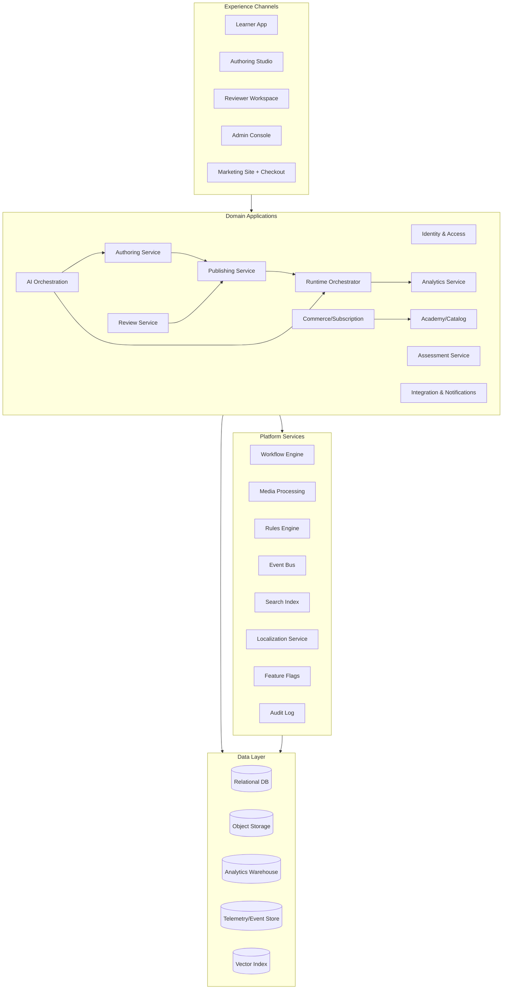

# System Architecture Draft

## 1) Major Subsystems

1. **Identity & Access Subsystem**
   - Authentication (SSO/social/passwordless)
   - Tenant/org/workspace model
   - RBAC and scoped entitlements

2. **Academy & Commerce Subsystem**
   - Catalog service (courses, bundles, tracks)
   - Pricing and offers
   - Checkout/payment orchestration
   - Subscription/entitlement service
   - Affiliate attribution tracking

3. **Authoring Subsystem**
   - Course/lesson structure manager
   - Block-scene-state editor backend
   - Asset/media library
   - Interaction logic engine (author-time)
   - Template/component registry

4. **Review & Governance Subsystem**
   - Review requests and assignment
   - Inline annotation threads
   - Approval gates and required signoffs
   - Version comparison and change logs

5. **Publishing & Packaging Subsystem**
   - Build pipeline (content normalization, validation)
   - Runtime artifact generation
   - Immutable version publishing
   - Rollback and scheduled release

6. **Learning Runtime Subsystem**
   - Lesson player orchestrator
   - Interaction runtime engine
   - Assessment runtime
   - Progress/completion tracker
   - Resource download gateway

7. **Analytics & Reporting Subsystem**
   - Event ingestion
   - Attempt/result processing
   - Learning metrics models
   - Business intelligence dashboards

8. **AI Orchestration Subsystem**
   - Prompt/task routing
   - Content generation services
   - Tutor/practice session services
   - Transcript/caption/translation pipeline
   - Safety, policy, and audit controls

9. **Communication & Integration Subsystem**
   - Notification service (email/in-app/webhooks)
   - API gateway
   - External connectors (CRM, payment, storage, BI)

## 2) Text-Based Architecture Diagram (Mermaid)

## 3) Bounded Contexts and Interfaces

- **Authoring Context** emits `content.version.created`, `review.requested`.
- **Review Context** emits `review.approved`, `review.rejected`.
- **Publishing Context** consumes review events; emits `content.published`.
- **Runtime Context** consumes published artifacts; emits granular xAPI-like learning events.
- **Analytics Context** consumes events and writes aggregate models.
- **Commerce Context** emits entitlement and transaction events consumed by runtime access control.

## 4) Deployment Perspective (High Level)

- API Gateway in front of stateless application services.
- Worker pools for media encoding, AI jobs, and publication builds.
- CDN for published runtime bundles and media assets.
- Streaming ingestion for analytics events; ETL into warehouse.
- Secrets management and signed URL strategy for protected assets.

## 5) Architectural Guardrails

- Authoring models and runtime models are separate schemas with explicit transformation.
- Published artifacts are immutable; editing creates a new draft version.
- Every learner interaction event references both `content_version_id` and `attempt_id`.
- AI-generated artifacts require provenance metadata and reviewer override capability.
