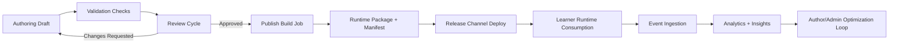
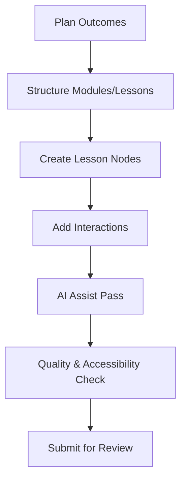
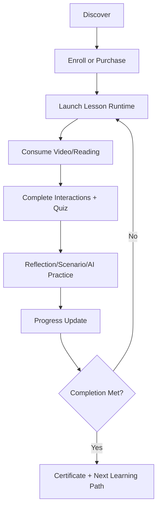
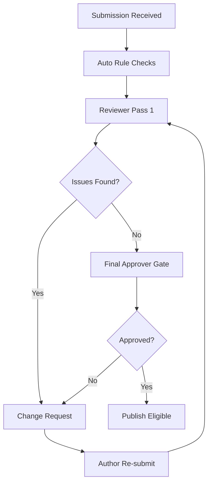

# UX Flow Draft — Admin, Author, Reviewer, Learner

## 1) Admin Flow (Business + Governance)

1. Create tenant/org and configure academy branding.
2. Configure roles, permissions, review policies, and publishing gates.
3. Set catalog strategy (courses/bundles/subscriptions).
4. Configure payment providers, coupons, affiliate policies.
5. Monitor operational dashboards (content throughput, revenue, engagement, risk alerts).
6. Manage release channels and rollback strategy.

## 2) Course Creator / Author Flow

1. Create course shell and define learning outcomes.
2. Build module/lesson map.
3. Author nodes by type: video, reading, quiz, reflection, scenario, AI-practice, resources.
4. Add interactions using block/scene/state model.
5. Use AI assistance for draft copy, question generation, transcript/caption setup.
6. Validate lesson logic (branching/completion rules/accessibility checks).
7. Submit version to review cycle.

## 3) Reviewer Flow

1. Receive assigned review task and open version snapshot.
2. Review pedagogy, factual quality, brand alignment, compliance, accessibility.
3. Annotate specific nodes/scenes/states.
4. Approve or request changes per gate criteria.
5. Final gate approval triggers publishing eligibility.

## 4) Student Flow

1. Discover content via catalog/search/recommendations.
2. Enroll/purchase/subscription entitlement resolution.
3. Start course and progress through lesson nodes.
4. Complete interactions, quizzes, reflections, scenarios, AI-practice.
5. Receive adaptive guidance and feedback signals.
6. Reach completion criteria and obtain certificate/next-path recommendations.

## 5) Publishing Flow (Authoring -> Review -> Publish -> Runtime -> Analytics)

## 6) Authoring Workflow Diagram

## 7) Learner Workflow Diagram

## 8) Review/Approval Workflow Diagram

